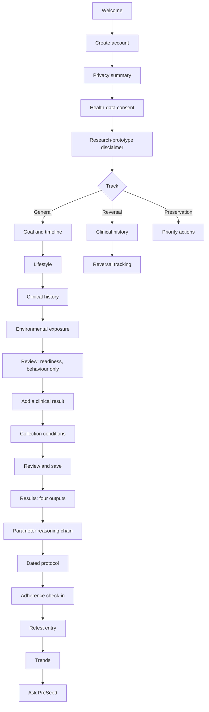
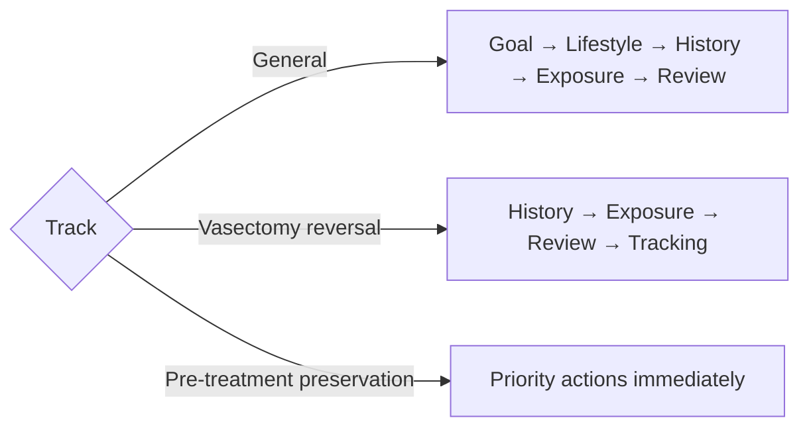
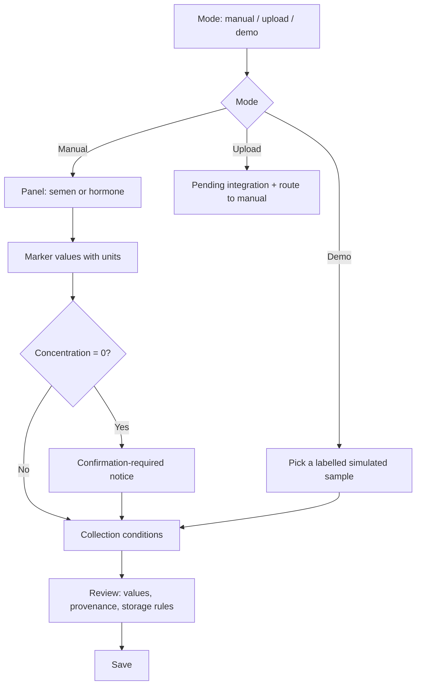
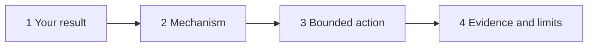
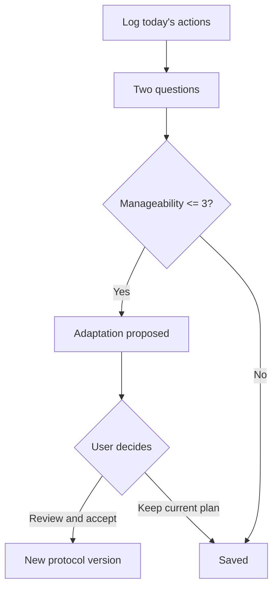

# User flows

- Status: Implemented
- Last updated: 2026-07-25

Every flow below is clickable in the prototype. `/prototype` lists them in order and
loads a demo state that places the user on day 97 of a 100-day protocol.

## The critical path

The hackathon demonstration route, end to end.

## 1. Signup and consent

**Objective.** Establish an account and obtain informed, separable permissions before
any health data is collected.

Five steps, each with a single decision. Consent is split deliberately: privacy is
information, health-data processing is a legal permission, and the research-prototype
disclaimer is an acknowledgement of limits. Bundling them would make all three
meaningless.

| Step | Screen | Gate |
| --- | --- | --- |
| 1 | Account | Email and password |
| 2 | Privacy summary | None — information only |
| 3 | Health-data consent | Explicit checkbox; Continue disabled until ticked |
| 4 | Research-prototype disclaimer | Explicit checkbox; Continue disabled until ticked |
| 5 | Track selection | One of three; Continue disabled until chosen |

**Withdrawal.** Consent is revocable from Account → Your data. Withdrawing stops
processing, offers export and deletion, and is confirmed through a sheet.

## 2. Track selection

The highest-leverage question in onboarding, so its consequences are stated *before*
the choice rather than discovered after it. Each option lists what changes.

**Reversal skips goal and lifestyle** because a fixed protocol clock is the wrong
shape for surgical recovery; what matters is laboratory results at the intervals a
surgeon sets.

**Preservation skips onboarding entirely.** The user goes straight to priority
actions. Asking about sleep before telling a man facing chemotherapy to contact a
fertility specialist would be a design failure with real consequences, and the brief
is explicit that lifestyle optimisation must not be prioritised over preservation.

## 3. Onboarding

**Objective.** Collect only what changes the experience, explain why anything
sensitive is asked, and never punish a refusal.

Four question screens plus a review. Progressive disclosure throughout: the recovery
question only appears if the user trains more than five times a week; the "why we
ask about steroids" explanation is a disclosure rather than a preamble.

**Refusal is a first-class answer.** "Prefer not to say" appears on every sensitive
question. It records that the question was asked and declined, leaves the domain
unscored, and lowers *data confidence* rather than readiness.

**Clinical gates fire inline.** Selecting testosterone or anabolic steroids renders
an escalation alert immediately on the clinical-history screen, before the user
continues. Non-modifiable conditions render an attention alert carrying the explicit
chip "Does not affect your readiness score".

## 4. Clinical test entry

**Objective.** Record what a laboratory measured, with enough context that the next
result can be compared with it.

One capture surface, three modes, three steps.

**Feedforward, not hindsight.** Step 2 opens by explaining that abstinence duration
alone changes volume and concentration independently of reproductive health, *before*
asking for it. This is the direct answer to the "gulf of execution" failure the
Strava critique identifies — a user should never discover after their second test
that the two cannot be compared.

**A zero is never a finding.** Entering `0` for concentration renders the mandatory
message immediately and records the result as *reported as zero, confirmation
required*. The word azoospermia never appears as a state the app has determined.

**Provenance is assigned, not chosen.** Typed values are stored as `user_entered`;
uploaded values would be `lab_report` until edited, then `user_confirmed`. The review
step states this.

## 5. Results and reasoning

**Objective.** Let a man understand what is known about him, in descending order of
how reliably it is known.

The hub presents the four outputs in a fixed order with numbered eyebrows
(`1 · Measured`, `2 · Behaviour`, `3 · Screening`, `4 · Trust`). Between outputs 1
and 2 sits the reasoning entry — one summary card per measurement below its reference
interval.

### The reasoning chain

Disclosure order within the chain, matching the required pattern:

1. Summary card — the measured value with its reference strip and provenance
2. **Why this applies to me** — open by default
3. Mechanism — serif, in the explanation register
4. Bounded action — with its category and its boundary stated
5. Evidence strength — confidence and interventional/observational per source
6. Study details — via the evidence card
7. **Known limitations** — collapsed, always present
8. Clinical escalation — only where the chain warrants it

Sources that are not citable are counted and excluded rather than hidden: *"1
referenced claim is excluded from recommendations pending verification."*

## 6. Protocol and adherence

**Objective.** Make a 100-day commitment feel like a day's work.

Today shows the current day, today's daily actions, this week's weekly actions, the
consistency band and one check-in entry point. The full plan is one tap away.

### Check-in

**Adaptations are proposed and confirmed.** A proposal names its reason, lists
specific changes, states which version accepting would create, and requires a
confirmation sheet. The previous version stays on record. The plan is never rewritten
silently.

**The trigger is honest.** A low manageability rating adapts the *plan*, not the
person: the copy reads "A target you keep is worth more than a target that reads
well."

## 7. Retest and trends

**Objective.** Show measured change without ever claiming to have caused it.

The trends screen opens with the refusal — a card stating that PreSeed cannot tell
you what caused a change — before any number appears. It then shows collection
comparability, the interval context (which protocol version was active, and adherence
across it), and per-marker change with absolute and percentage delta.

Every comparison is tested against a **±25% natural variability band**. Differences
inside it are labelled "not readable as change". Differences outside it are labelled
larger than expected variation, immediately followed by the statement that two
samples are not an experiment.

## 8. Vasectomy-reversal track

**Objective.** Longitudinal tracking around real laboratory results.

- The mandatory azoospermia notice renders at the top of the screen and cannot be
  dismissed.
- A four-week reminder interval is derived from the latest result, with the explicit
  caveat that the surgeon's direction takes priority.
- The concentration trend is the primary visualisation, with recovery framed as a
  pattern rather than a prediction.
- Every analysis appears in a chronological record with laboratory, abstinence and
  provenance.
- Any zero result is labelled *reported as zero — confirmation required* everywhere it
  appears.
- Escalation criteria are listed explicitly.
- No 100-day protocol is offered, and the disclosure explains why.

## 9. Pre-treatment preservation track

**Objective.** Move someone toward a specialist before treatment starts.

An urgency and navigation screen, in priority order:

1. Escalation alert stating preservation comes before anything else in the app
2. Treatment start date, producing a live countdown
3. Four immediate actions, weighted — "Ask for a fertility specialist referral today"
   is marked *Highest impact* because specialist contact is the strongest predictor of
   whether banking happens
4. Six written questions for the oncology team
5. Banking-service directory — a labelled pending integration
6. Two disclosures: why this track looks different, and what PreSeed will not claim

There is no protocol, no readiness emphasis and no testing claim on this track.

## 10. Contextual explanation

**Objective.** Answer "why?" without inventing anything.

Launched from a marker, a risk output, a readiness domain, a recommendation, a
protocol item or an evidence card. The context is pinned in a sticky bar
(`Discussing: progressive motility result`) and never scrolls away.

Three response states are designed:

| State | When | Treatment |
| --- | --- | --- |
| Cited | Approved evidence supports an answer | Answer, citation list, limitations |
| Evidence insufficient | The question is reasonable, the evidence is not strong enough | Says so plainly, offers the strong version of the action instead |
| Explanation unavailable | The output is unverified, e.g. an externally generated risk band | Refuses to interpret, redirects to the measured value |

Every response ends with its limitations. The prototype's answers are authored, not
generated, and the screen says so.
